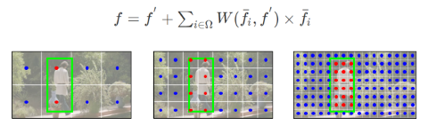

# PCNet for Person Search

## Introduction

Person search uniformly performs person detection and feature extraction. It requires the model to detect boxes and extract their corresponding ReID feature. Most of current works are based on two-stage detector like Faster-RCNN, which applies feature cropping for ReID feature extraction, *e.g.*, RoIPooling or RoIAlign. This two-stage detector framework suffers from sensitivity to detectection error as well as the incapability of capturing context information outside bounding boxes. Worse still, the roi-wise computation in the detector head results in great overhead.

This repo targets at addressing the above issues with the one-stage detector. 
Without feature cropping, one-stage detector almost retains the intact context within the feature map. ReID features are then extracted by adaptively aggregating features at local points throughout the entire pyramid. This enables the feature to explore beneficial context outside boxes. Inheriting the faster speed of one-stage detector, the model in this repo shows superior inference speed compared to currrent works. We name the model of this repo as Points-in-Context Network (PCNet).

Specifically, the points aggregation process composes of two modules, **C**ontextual **P**oints **P**ooling (CPP) and **C**ross **S**cale **A**ggregation (CSA), both of which aim at utilizing the context to largest extent. Moreover, we propose a new detector head to alleviate the contradiction of learning commonness and differences in the joint person search model.

To run the code, following the instructions in [REPO.md](https://github.com/zhongyingji/PCNetPS/blob/main/REPO.md). We wrote a blog about the repo in Chinese at [Zhihu]().

## Overview
PCNet is based on RetinaNet, which is built upon a feature pyramid . The detection head firstly extracts ReID feature by CPP, which generates the pyramid of ReID feature . The detection feature map, *e.g.*,  and  are then decoded from that. We then get the position survived non-maximum-suppression (NMS). CSA is applied to aggregate points vertically across pyramids for further enhancement. 

## Methodology
**Detection Head**

The detector head firstly predicts ReID feature and then the detection feature. It is motivated by the intuition that, if we can tell the differences between persons, we can differentiate persons and backgrounds, since the former task requires much information. It is proposed to alleviate the issue of contradictory learning between commonness (detection) and differences (ReID), following the intuition that commonness can be decoded from differences. In this way, no contradiction happens in the sequential structure. Figure below illustrates that, though ReID feature map (b) encodes information of differences, distinguishing foregound and background can be indicated by the intensity.

**Contextual Points Pooling**

As mentioned before, context outside box is sometimes crucial for discriminative feature. Instead of applying RoIAlign for feature extraction, CPP adaptively aggregates the informative points for each position. This is a box-free process, thus the aggreagtion is not limited to the restrict area of bounding box. CPP is implemented with the deformable convolution and the addition distance loss, since we observe that the points tend to gather in a local area. $m$ refers to the vertical coordinate of mass center of each splitted set.  

**Cross Scale Aggregation**

Although the feature from CPP contains certain context and is discriminative, it only contains information of a single scale. The person can be detected from any level of the pyramid, umere feature from CPP will cause scale misalignment. For the position in feature pyramid that survives NMS, CSA firstly selects the candidate points for it and then aggregates them as the final ReID feature. They are linearly combined. Except $f$, all other features are directly extracted from  from corresponding postions.

## Experiment
PCNet achieves competitive performance on current benchmarks. It also exhibits superior inference speed. We temporarily attribute the lower performance on CUHK-SYSU to the anchor setting.

## Citation

If you find this work or code is helpful in your research, please consider citing:

